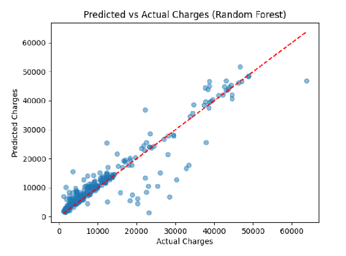

# 🧾 Medical Insurance Cost Prediction

Machine learning project that predicts **medical insurance charges** using demographic and health data.

---

## 🌟 Highlights

- Predicts insurance costs using regression models  
- Compares **Linear Regression**, **Polynomial Regression**, and **Random Forest**  
- Uses a real dataset with **1,338 records**  
- Identifies the most important factors affecting insurance charges  
- Final best model: **Random Forest Regressor**

---

## ℹ️ Overview

Medical insurance costs vary widely depending on personal and lifestyle factors.  
This project applies **machine learning regression models** to estimate insurance charges based on features such as age, BMI, smoking status, and region.

The goal is to evaluate different regression approaches and determine which model predicts medical insurance charges most accurately.

---

## 📊 Dataset

Features:

- age  
- sex  
- bmi  
- children  
- smoker  
- region  

Target:

- charges

Dataset size: **1,338 records**

---

## 🤖 Models

Models implemented:

- Linear Regression  
- Polynomial Regression (degree 2)  
- Random Forest Regressor  

Best performing model: **Random Forest Regressor**



---

## 🚀 Usage

Example model training:

```python
from sklearn.ensemble import RandomForestRegressor

model = RandomForestRegressor()
model.fit(X_train, y_train)

predictions = model.predict(X_test)
